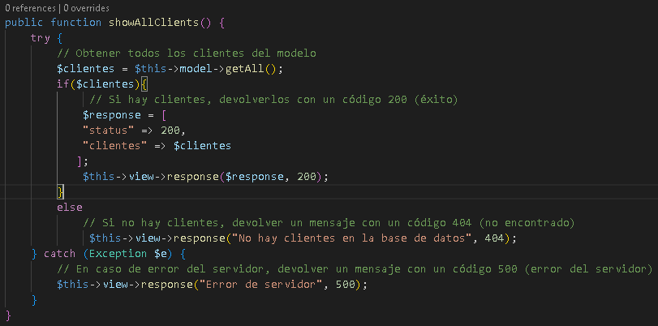
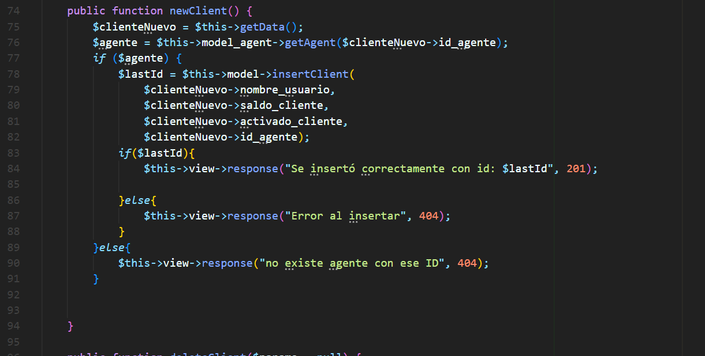
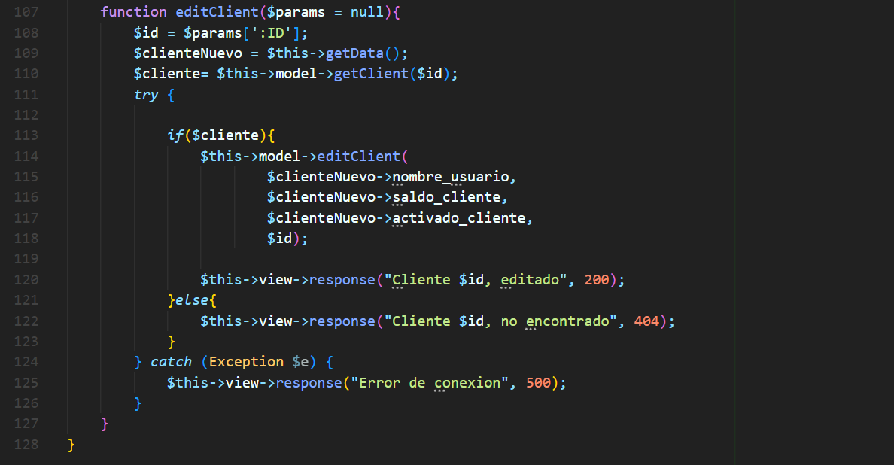
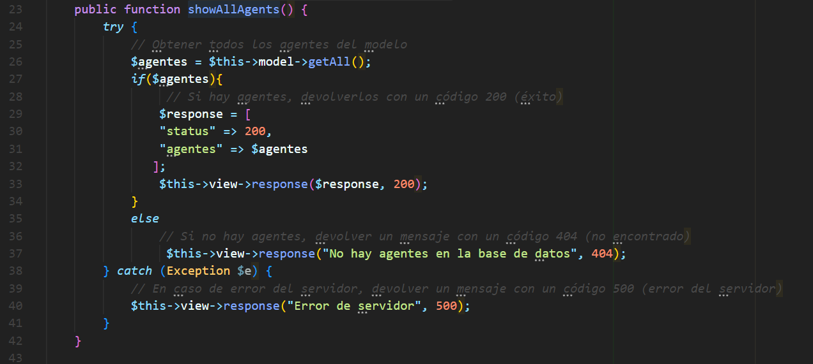
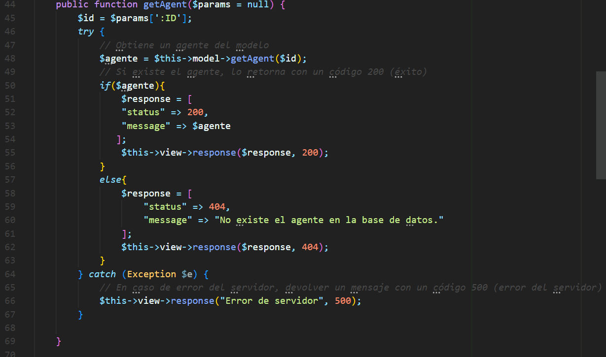
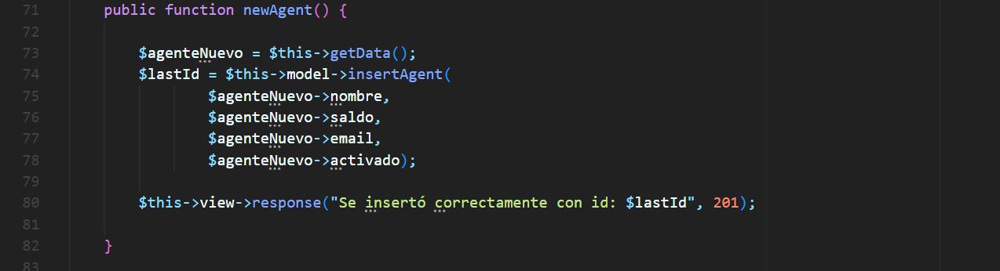
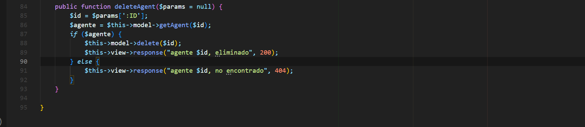
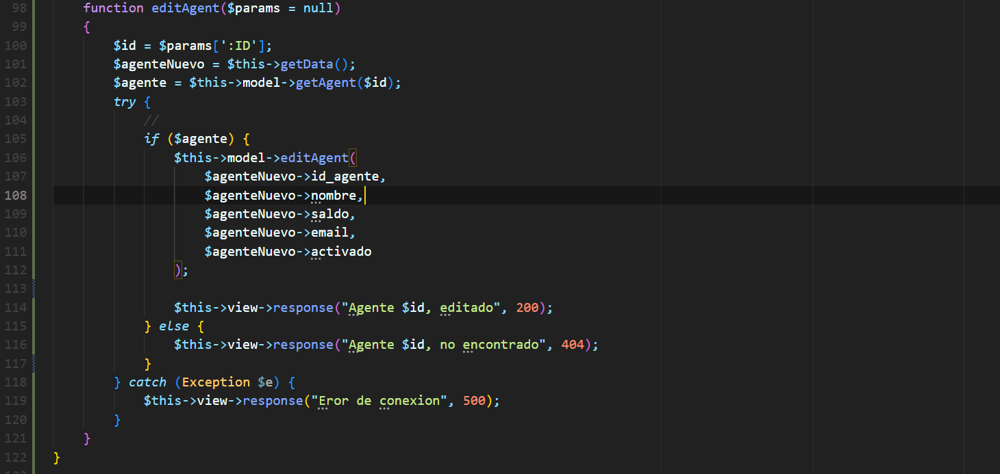

# https://markdown.es/sintaxis-markdown/
## Índice
1. [clienteApiController](#documentación-clienteapicontroller)
    - [Función `showAllClients()`](#función-showallclients)
    - [Función `getClient()`](#función-getclient)
    - [Función `deleteClient()`](#función-deleteclient)
    - [Función `editClient()`](#función-editclient)
    - [Función `newClient()`](#función-newclient)
2. [agenteApiController](#documentación-agenteapicontroller)
     - [Función `showAllAgents()`](#función-showallagents)
     - [Función `getAgent()`](#función-getagent)
     - [Función `deleteAgent()`](#función-deleteagent)
     - [Función `editAgent()`](#función-editagent)
     - [Función `newAgent()`](#función-newagent)
  
3. [AuthApiController ](#documentación-authapicontroller)
    - [Función `getAllUsers()`](#función-getallusers)
    - [Función `getUser()`](#función-getuser)
4. [Requisitos y notas adicionales](#requisitos-y-notas-adicionales)

___

# Documentación `clienteApiController`
## Introducción
El clienteApiController es una clase encargada de manejar las solicitudes relacionadas con los clientes dentro de nuestra aplicación. Actúa como un intermediario entre el cliente y el modelo de datos, proporcionando una interfaz para interactuar con los clientes a través de varias operaciones CRUD (Crear, Leer, Actualizar, Eliminar). El objetivo principal del clienteApiController es facilitar una gestión eficiente y organizada de los clientes, garantizando que todas las operaciones se realicen de manera coherente y segura.
A continuación se detallan cada una de sus funciones.


 

## Función `showAllClients()`

### Descripción
La función `showAllClients` del controlador obtiene todas los clientes de la base de datos y envía una respuesta adecuada al cliente basado en el resultado.





### Retorno
La función no retorna ningún valor directamente. En su lugar, envía una respuesta al cliente utilizando el objeto `view`. Los posibles códigos de estado de respuesta son:

- **200 OK:** Si se obtuvieron clientes correctamente.
- **404 Not Found:** Si no hay clientes en la base de datos.
- **500 Internal Server Error:** Si ocurre un error del servidor al intentar obtener los clientes.

## Ejemplos de uso 
## URL: `API_Casino/api/clientes`
## METODO : GET
## Query Params `?atributo=nombre_usuario&order=asc`

### Ejemplo 1: Obtención exitosa de clientes

Si hay clientes en la base de datos, la función enviará una respuesta con código 200 y los clientes en formato JSON:
```json
{
    "status": 200,
    "clientes": [
        {
            "id_cliente": 1,
            "nombre_usuario": "Juan",
            "saldo_cliente": 3500,
            "activado_cliente": 1,
            "id_agente": 2
        }
        ...
    ]
}
```

### Ejemplo 2: Clientes no encontradas

Si no existen clientes en la base de datos, la función enviará una respuesta con código 404 y un mensaje de error:
```json
{
   {
    "status": 404,
    "message": "No hay clientes en la base de datos"
   }
}
```
### Ejemplo 3: Error de servidor

Si ocurre un error del servidor, la función enviará una respuesta con código 500 y un mensaje de error:

```json
{
    "status": 500,
    "message": "Error de servidor: [detalles del error]"
}
```


## Función `getClient()`

### Descripción
La función `getClient` obtiene el cliente que se desee siempre y cuando coincida el id del mismo, con el que se introduce a la hora de realizar la busqueda. Si el Id no existe, envia un mensaje en el que dice que no existe el cliente en la base de datos.


### Retorno
La función no retorna ningún valor directamente. 

- **201 CREATED:** Si se creo el cliente correctamente
- **404 Not Found:** Si no es posible crear el cliente, o el id del agente ingresado no existe.

## Ejemplos de uso 
## URL: `API_Casino/api/clientes`
## METODO : POST

### Ejemplo 1: 
Si existe el cliente en la base de datos, la función enviará una respuesta con código 200 y el cliente en formato JSON:

```json
   {
        "id_cliente": 0,
        "nombre_usuario": "Prueba",
        "saldo_cliente": 3500,
        "activado_cliente": 1,
        "id_agente": 2
   }
```


### Ejemplo 2: Cliente no encontrado (falta terminar)

Si no existe el cliente que se busco en la base de datos, la función enviará una respuesta con código 404 y un mensaje de error:
```json
{
   {
    "status": 404,
    "message": "No existe ese cliente en la base de datos"
   }
}
```
### Ejemplo 3: Error de servidor

Si ocurre un error del servidor, la función enviará una respuesta con código 500 y un mensaje de error:

```json
{
    "status": 500,
    "message": "Error de servidor: [detalles del error]"
}
```


## Función `newClient()`

### Descripción
La función `newClient` lo que hace es crear un nuevo cliente, y en base a si se crea o no envia una respuesta de parte del servidor.




### Retorno
La función no retorna ningún valor directamente. 

- **201 CREATED:** Si se creo el cliente correctamente
- **404 Not Found:** Si no es posible crear el cliente, o el id del agente ingresado no existe.

## Ejemplos de uso 
## URL: `API_Casino/api/clientes`
## METODO : POST

### Ejemplo 1: Creación exitosa del Cliente

Elegimos el método POST y ponemos los siguientes datos en body.Los datos ingresados son en forma de ejemplo.

```json
          {
            "nombre_usuario": "ALBERTO",
            "saldo_cliente": 2000,
            "activado_cliente": 1,
            "id_agente": 2
        }
```


### Ejemplo 2: Cliente no creado o Agente inexistente

Si el ID de agente que se ingresa no existe y si al crear el cliente ponemos algun dato mal del post, va a aparecer el siguiente mensaje.
```json
{
   {
    "status": 404,
    "message": "Eror al insertar"o"No existe agente con ese ID"
   }
}
```

### Ejemplo 3: Error de servidor

Si ocurre un error del servidor, la función enviará una respuesta con código 500 y un mensaje de error:

```json
{
    "status": 500,
    "message": "Error de servidor: [detalles del error]"
}
```

## Función `deleteClient()`

### Descripción
En esta funcion podes eliminar un cliente de la base de datos ingresando su ID, Si el ID que se ingresa no existe, va a aparecer un mensaje de error, sino va a eliminar el cliente.


### Retorno
La función no retorna ningún valor directamente.

- **200 OK:** Si se eliminó un cliente correctamente.
- **404 Not Found:** Si no existe el cliente en la base de datos.
- **500 Internal Server Error:** Si ocurre un error del servidor al intentar obtener el cliente.

## Ejemplos de uso `http://localhost/proyectos/API_Casino/api/clientes/1`
### Ejemplo 1: Eliminacion exitosa de el cliente

Si el cliente con el ID proporcionado existe, la función enviará una respuesta con código 200 y el id del cliente eliminado.

### Ejemplo 2: cliente no encontrado

Si no existe un cliente con el ID proporcionado, la función enviará una respuesta con código 404 y un mensaje de error:
```json
{
   {
    "status": 404,
    "message": "No existe el cliente con id: 2"
   }
}
```

### Ejemplo 3: Error de servidor

Si ocurre un error del servidor, la función enviará una respuesta con código 500 y un mensaje de error:

```json
{
    "status": 500,
    "message": "Error de servidor: [detalles del error]"
}
```
## Función `editClient()`

### Descripción
En esta funcion se puede editar el cliente, en el body del Postman ingresas los datos en formato JSON y cambias los datos que vas a editar.



### Retorno
La función no retorna ningún valor directamente.

- **200 OK:** Si se edito un cliente correctamente.
- **404 Not Found:** Si no existe el cliente en la base de datos.
- **500 Internal Server Error:** Si ocurre un error del servidor al intentar obtener el cliente.

## Ejemplos de uso `http://localhost/proyectos/API_Casino/api/clientes/1`
### Ejemplo 1: Edicion exitosa de el cliente

Si el cliente con el ID proporcionado existe, los datos se van a cambiar a los nuevos que se ingresen, correctamente.

### Ejemplo 2: cliente no encontrado

Si no existe un cliente con el ID proporcionado, la función enviará una respuesta con código 404 y un mensaje de error:
```json
{
   {
    "status": 404,
    "message": "No encontrado"
   }
}
```

### Ejemplo 3: Error de servidor

Si ocurre un error del servidor, la función enviará una respuesta con código 500 y un mensaje de error:

```json
{
    "status": 500,
    "message": "Error de servidor: [detalles del error]"
}
```


## Sector Agentes


## Introducción
El agenteApiController es una clase encargada de manejar las solicitudes relacionadas con los agentes dentro de nuestra aplicación. Actúa como un intermediario entre el agente y el modelo de datos, proporcionando una interfaz para interactuar con los agentes a través de varias operaciones CRUD (Crear, Leer, Actualizar, Eliminar). El objetivo principal del agenteApiController es facilitar una gestión eficiente y organizada de los agentes, garantizando que todas las operaciones se realicen de manera coherente y segura.
A continuación se detallan cada una de sus funciones.


## Función `showAllAgents()`

### Descripción
La función `showAllAgents` del controlador obtiene todas los agentes de la base de datos y envía una respuesta adecuada al cliente basado en el resultado.





### Retorno
La función no retorna ningún valor directamente. En su lugar, envía una respuesta al cliente utilizando el objeto `view`. Los posibles códigos de estado de respuesta son:

- **200 OK:** Si se obtuvieron agentes correctamente.
- **404 Not Found:** Si no hay agentes en la base de datos.
- **500 Internal Server Error:** Si ocurre un error del servidor al intentar obtener los agentes.

## Ejemplos de uso
## URL: `API_Casino/api/agentes`
## METODO : GET
## Query Params `?atributo=nombre_usuario&order=asc`

### Ejemplo 1: Obtención exitosa de agentes

Si hay agentes en la base de datos, la función enviará una respuesta con código 200 y los agentes en formato JSON:
```json
{
"status": 200,
"agentes": [
{
"id_agente": 1,
"email": "lucassosa2019@hotmail.com",
"saldo": 3500,
"activado": 1,
}
...
]
}
```

### Ejemplo 2: agentes no encontradas

Si no existen agentes en la base de datos, la función enviará una respuesta con código 404 y un mensaje de error:
```json
{
{
"status": 404,
"message": "No hay agentes en la base de datos"
}
}
```
### Ejemplo 3: Error de servidor

Si ocurre un error del servidor, la función enviará una respuesta con código 500 y un mensaje de error:

```json
{
"status": 500,
"message": "Error de servidor: [detalles del error]"
}
```


## Función `getAgent()`

### Descripción
La función `getAgent` obtiene el agente que se desee siempre y cuando coincida el id del mismo, con el que se introduce a la hora de realizar la busqueda. Si el Id no existe, envia un mensaje en el que dice que no existe el agente en la base de datos.




### Retorno
La función no retorna ningún valor directamente.

- **201 CREATED:** Si se creo el agente correctamente
- **404 Not Found:** Si no es posible crear el agente, o el id del agente ingresado no existe.

## Ejemplos de uso
## URL: `API_Casino/api/agentes`
## METODO : GET

### Ejemplo 1:

Si existe el agente en la base de datos, la función enviará una respuesta con código 200 y el agente en formato JSON:
```json
{
    "status": 200,
    "message": {
        "id_agente": 2,
        "nombre": "Alejandro",
        "saldo": 50000,
        "email": "alejandro@hotmail.com",
        "activado": 1
    }
}
```

### Ejemplo 2: Agente no encontrado

Si no existe el agente que se busco en la base de datos, la función enviará una respuesta con código 404 y un mensaje de error:
```json
{
{
"status": 404,
"message": "No existe ese agente en la base de datos"
}
}
```
### Ejemplo 3: Error de servidor

Si ocurre un error del servidor, la función enviará una respuesta con código 500 y un mensaje de error:

```json
{
"status": 500,
"message": "Error de servidor: [detalles del error]"
}
```


## Función `newAgent()`

### Descripción
La función `newAgent` lo que hace es crear un nuevo agente, y en base a si se crea o no envia una respuesta de parte del servidor.




### Retorno
La función no retorna ningún valor directamente.

- **201 CREATED:** Si se creo el agente correctamente
- **404 Not Found:** Si no es posible crear el agente, o el id del agente ingresado no existe.

## Ejemplos de uso
## URL: `API_Casino/api/agentes`
## METODO : POST

### Ejemplo 1: Creación exitosa del Agente

Elegimos el método POST y ponemos los siguientes datos en body.Los datos ingresados son en forma de ejemplo.

```json
{
  
           "nombre": "anibal",
            "saldo": 20000,
            "email": "lucassosa2019@hotmail.com",
            "activado": 1
        
}
```


### Ejemplo 2: Agente no creado

Si el ID de agente que se ingresa no existe va a aparecere el siguiente mensaje
```json
{
{
"status": 404,
"message": "Eror al insertar"
}
}
```

### Ejemplo 3: Error de servidor

Si ocurre un error del servidor, la función enviará una respuesta con código 500 y un mensaje de error:

```json
{
"status": 500,
"message": "Error de servidor: [detalles del error]"
}
```

## Función `deleteAgent()`

### Descripción
En esta funcion podes eliminar un agente de la base de datos ingresando su ID, Si el ID que se ingresa no existe, va a aparecer un mensaje de error, sino va a eliminar el agente.




### Retorno
La función no retorna ningún valor directamente.

- **200 OK:** Si se eliminó un agente correctamente.
- **404 Not Found:** Si no existe el agente en la base de datos.
- **500 Internal Server Error:** Si ocurre un error del servidor al intentar obtener el agente.

## Ejemplos de uso `http://localhost/proyectos/API_Casino/api/agentes/1`
### Ejemplo 1: Eliminacion exitosa de el agente

Si el agente con el ID proporcionado existe, la función enviará una respuesta con código 200 y el id del agente eliminado.

### Ejemplo 2: agente no encontrado

Si no existe un agente con el ID proporcionado, la función enviará una respuesta con código 404 y un mensaje de error:
```json
{
{
"status": 404,
"message": "agente $id, no encontrado"
}
}
```

### Ejemplo 3: Error de servidor

Si ocurre un error del servidor, la función enviará una respuesta con código 500 y un mensaje de error:

```json
{
"status": 500,
"message": "Error de servidor: [detalles del error]"
}
```


## Función `editAgent()`

### Descripción
En esta funcion se puede editar el agente, en el body del Postman ingresas los datos en formato JSON y cambias los datos que vas a editar.



### Retorno
La función no retorna ningún valor directamente.

- **200 OK:** Si se edito un agente correctamente.
- **404 Not Found:** Si no existe el agente en la base de datos.
- **500 Internal Server Error:** Si ocurre un error del servidor al intentar obtener el agente.

## Ejemplos de uso `http://localhost/proyectos/API_Casino/api/agentes/1`
### Ejemplo 1: Edicion exitosa de el agente

Si el agente con el ID proporcionado existe, los datos se van a cambiar a los nuevos que se ingresen, correctamente.

### Ejemplo 2: agente no encontrado

Si no existe un agente con el ID proporcionado, la función enviará una respuesta con código 404 y un mensaje de error:
```json
{
{
"status": 404,
"message": "No encontrado"
}
}
```

### Ejemplo 3: Error de servidor

Si ocurre un error del servidor, la función enviará una respuesta con código 500 y un mensaje de error:

```json
{
"status": 500,
"message": "Error de servidor: [detalles del error]"
}
```


## Requisitos y notas adicionales
- Modelo de tarea debe implementar los siguientes métodos `getTasks`, `getTask`.
- Modelo de usuario debe implementar los siguientes métodos `getAllUsers`, `getUser`.
- Vista que implemente el método `response`.
