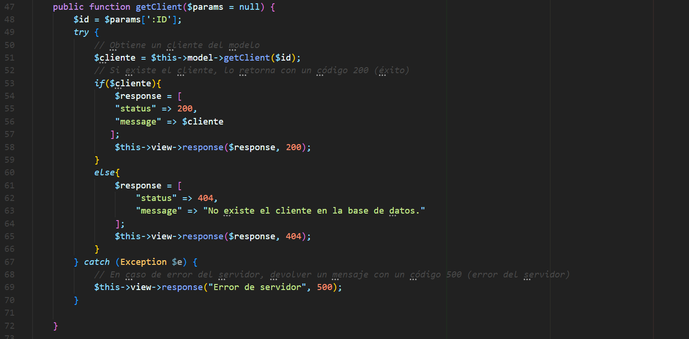

# https://markdown.es/sintaxis-markdown/
## Índice
1. [clienteApiController](#documentación-clienteapicontroller)
    - [Función `showAllClients()`](#función-showallclients)
    - [Función `getClient()`](#función-getclient)
2. [UserApiController](#documentación-userapicontroller)
    - [Función `getAllUsers()`](#función-getallusers)
    - [Función `getUser()`](#función-getuser)
3. [Requisitos y notas adicionales](#requisitos-y-notas-adicionales)

___

# Documentación `clienteApiController`
## Introducción
El clienteApiController es una clase encargada de manejar las solicitudes relacionadas con los clientes dentro de nuestra aplicación. Actúa como un intermediario entre el cliente y el modelo de datos, proporcionando una interfaz para interactuar con los clientes a través de varias operaciones CRUD (Crear, Leer, Actualizar, Eliminar). El objetivo principal del clienteApiController es facilitar una gestión eficiente y organizada de los clientes, garantizando que todas las operaciones se realicen de manera coherente y segura.
A continuación se detallan cada una de sus funciones.


 

## Función `showAllClients()`

### Descripción
La función `showAllClients` del controlador obtiene todas los clientes de la base de datos y envía una respuesta adecuada al cliente basado en el resultado.


### Retorno
La función no retorna ningún valor directamente. En su lugar, envía una respuesta al cliente utilizando el objeto `view`. Los posibles códigos de estado de respuesta son:

- **200 OK:** Si se obtuvieron clientes correctamente.
- **404 Not Found:** Si no hay clientes en la base de datos.
- **500 Internal Server Error:** Si ocurre un error del servidor al intentar obtener los clientes.

## Ejemplos de uso 
## URL: `API_Casino/api/clientes`
## METODO : GET
## Query Params `?atributo=nombre_usuario&order=asc`

### Ejemplo 1: Obtención exitosa de clientes

Si hay clientes en la base de datos, la función enviará una respuesta con código 200 y los clientes en formato JSON:
```json
{
    "status": 200,
    "clientes": [
        {
            "id_cliente": 1,
            "nombre_usuario": "Juan",
            "saldo_cliente": 3500,
            "activado_cliente": 1,
            "id_agente": 2
        }
        ...
    ]
}
```

### Ejemplo 2: Clientes no encontradas

Si no existen clientes en la base de datos, la función enviará una respuesta con código 404 y un mensaje de error:
```json
{
   {
    "status": 404,
    "message": "No hay clientes en la base de datos"
   }
}
```
## Función `newClient()`

### Descripción
La función `newClient` lo que hace es crear un nuevo cliente, y en base a si se crea o no envia una respuesta de parte del servidor.


### Retorno
La función no retorna ningún valor directamente. 

- **201 CREATED:** Si se creo el cliente correctamente
- **404 Not Found:** Si no es posible crear el cliente, o el id del agente ingresado no existe.

## Ejemplos de uso 
## URL: `API_Casino/api/clientes`
## METODO : POST

### Ejemplo 1: Creación exitosa del Cliente

Elegimos el método POST y ponemos los siguientes datos en body, el id_cliente en 0 para que cuando lo cree, ponga el id que corresponde siguiendo el orden ascende que tiene por defecto.

   {
        "id_cliente": 0,
        "nombre_usuario": "Prueba",
        "saldo_cliente": 3500,
        "activado_cliente": 1,
        "id_agente": 2
   }


### Ejemplo 3: Error de servidor

Si ocurre un error del servidor, la función enviará una respuesta con código 500 y un mensaje de error:

```json
{
    "status": 500,
    "message": "Error de servidor: [detalles del error]"
}
```

### Notas 

<!-- - **La inclusión del mensaje de excepción (`$e->getMessage()`) en la respuesta de error del servidor puede ser útil para depuración, pero puede exponer detalles sensibles del servidor. Considera esta práctica con cuidado, especialmente en entornos de producción.** 
- **Asegúrate de manejar adecuadamente las excepciones y errores en el modelo y la vista para evitar problemas inesperados.**  -->


___


## Función `getClient()`

### Descripción
La función `getClient` del controlador obtiene un cliente específico de la base de datos y envía una respuesta adecuada al cliente basado en el resultado.





### Parámetros
**`$params (array)`: Un array asociativo que contiene los parámetros de la solicitud. En este caso, se espera que contenga '`:ID`', el identificador de el cliente que se desea obtener.**

### Retorno
La función no retorna ningún valor directamente. En su lugar, envía una respuesta al cliente utilizando el objeto `view`. Los posibles códigos de estado de respuesta son:

- **200 OK:** Si se obtuvieron clientes correctamente.
- **404 Not Found:** Si no hay clientes en la base de datos.
- **500 Internal Server Error:** Si ocurre un error del servidor al intentar obtener los clientes.

## Ejemplos de uso `http://localhost/proyectos/WEB2/API_Casino/api/clientes/1`
### Ejemplo 1: Obtención exitosa de el cliente

Si el cliente con el ID proporcionado existe, la función enviará una respuesta con código 200 y el cliente en formato JSON:
```json
{
    "status": 200,
    "message": [{
        "id_cliente": 2,
        "nombre_usuario": "Anibal",
        "saldo_cliente": 15000,
        "activado_cliente": 1,
        "id_agente": 2
    }]
}
```

### Ejemplo 2: cliente no encontrado

Si no existe un cliente con el ID proporcionado, la función enviará una respuesta con código 404 y un mensaje de error:
```json
{
   {
    "status": 404,
    "message": "No existe el cliente con id: 2"
   }
}
```

### Ejemplo 3: Error de servidor

Si ocurre un error del servidor, la función enviará una respuesta con código 500 y un mensaje de error:

```json
{
    "status": 500,
    "message": "Error de servidor: [detalles del error]"
}
```

### Notas 

<!-- - **La inclusión del mensaje de excepción (`$e->getMessage()`) en la respuesta de error del servidor puede ser útil   para depuración, pero puede exponer detalles sensibles del servidor. Considera esta práctica con cuidado, especialmente en entornos de producción.** 
- **Asegúrate de manejar adecuadamente las excepciones y errores en el modelo y la vista para evitar problemas inesperados.**  -->
## Función `deleteClient()`

### Descripción
La función `deleteClient` del controlador obtiene un cliente específico de la base de datos y envía una respuesta adecuada al cliente basado en el resultado.


### Retorno
La función no retorna ningún valor directamente. En su lugar, envía una respuesta al cliente utilizando el objeto `view`. Los posibles códigos de estado de respuesta son:

- **200 OK:** Si se eliminó un cliente correctamente.
- **404 Not Found:** Si no existe el cliente en la base de datos.
- **500 Internal Server Error:** Si ocurre un error del servidor al intentar obtener el cliente.

## Ejemplos de uso `http://localhost/proyectos/API_Casino/api/clientes/1`
### Ejemplo 1: Obtención exitosa de el cliente

Si el cliente con el ID proporcionado existe, la función enviará una respuesta con código 200 y el id del cliente eliminado en formato JSON:
```json
{
    "status": 200,
    "message": [{
        "id_cliente": 2,
        "nombre_usuario": "Anibal",
        "saldo_cliente": 15000,
        "activado_cliente": 1,
        "id_agente": 2
    }]
}
```

### Ejemplo 2: cliente no encontrado

Si no existe un cliente con el ID proporcionado, la función enviará una respuesta con código 404 y un mensaje de error:
```json
{
   {
    "status": 404,
    "message": "No existe el cliente con id: 2"
   }
}
```

### Ejemplo 3: Error de servidor

Si ocurre un error del servidor, la función enviará una respuesta con código 500 y un mensaje de error:

```json
{
    "status": 500,
    "message": "Error de servidor: [detalles del error]"
}
```

### Notas 


___

# Documentación `UserApiController`
## Introducción
............................................
..............................................
.................................................

## Función `getAllUsers()`

### Descripción
............................................
..............................................
.................................................


## Función `getUser()`

### Descripción
............................................
..............................................
.................................................


___


## Requisitos y notas adicionales
- Modelo de tarea debe implementar los siguientes métodos `getTasks`, `getTask`.
- Modelo de usuario debe implementar los siguientes métodos `getAllUsers`, `getUser`.
- Vista que implemente el método `response`.
